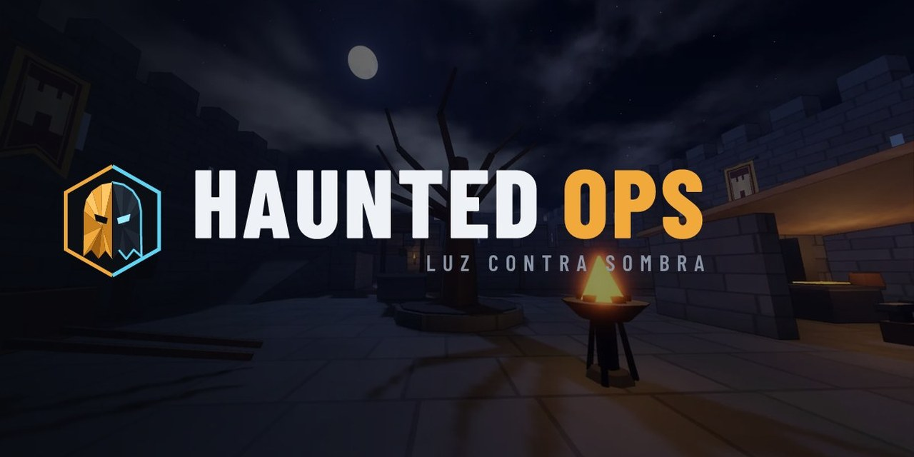
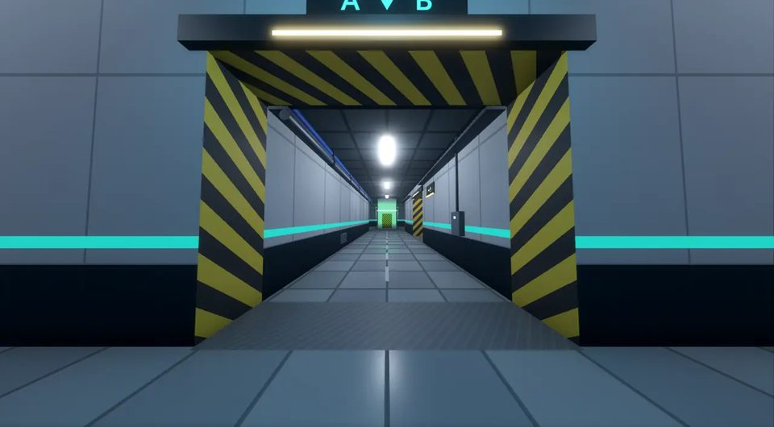
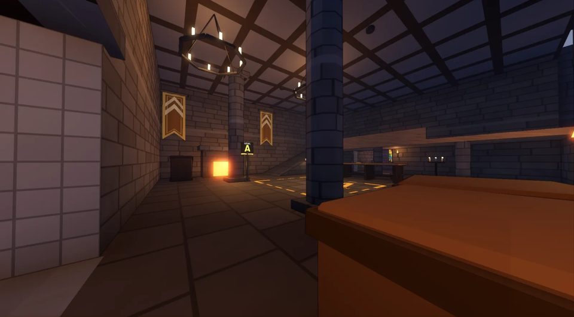
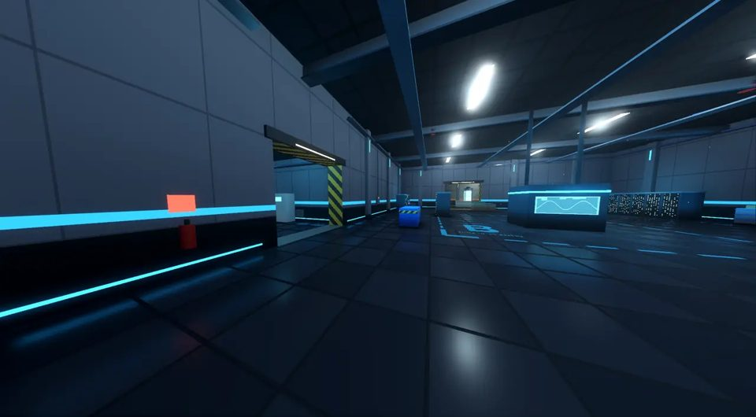
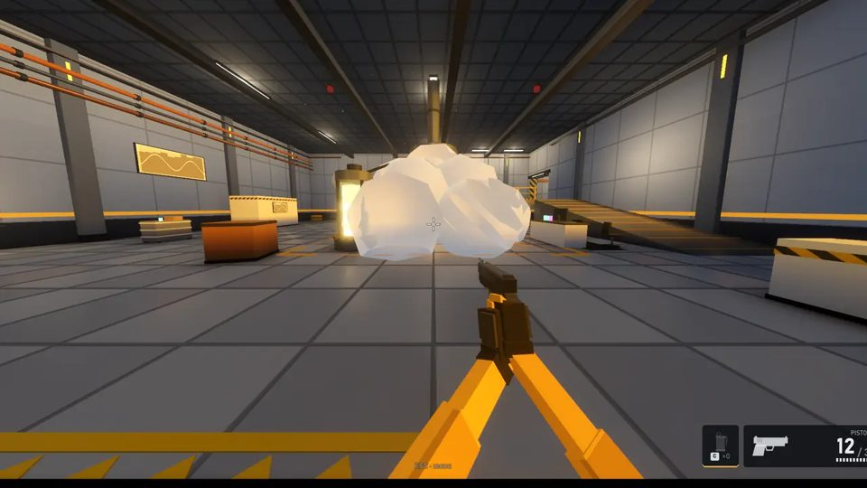

  

  <b>FPS tático 5v5 em low poly. Grátis.</b> 
  A Ordem da Lanterna contra as Sombras, invisíveis quando paradas.

  
  
  

---

## Baixar

O jeito mais fácil é pelo site: **[hauntedops.com.br](https://hauntedops.com.br/#baixar)** já oferece o arquivo certo para o seu aparelho.

| Sistema | Arquivo | |
|---|---|---|
| **Windows** 10 ou 11 (64 bits) | [HauntedOps-Setup.exe](https://github.com/DouglasVulcano/haunted-ops-releases/releases/latest/download/HauntedOps-Setup.exe) | Instalador. O jogo se atualiza sozinho a cada abertura. |
| **macOS** (beta) | [HauntedOps-Setup-macOS.zip](https://github.com/DouglasVulcano/haunted-ops-releases/releases/latest/download/HauntedOps-Setup-macOS.zip) | Apple Silicon e Intel. Na primeira vez: botão direito no app › Abrir. |
| **Android** 7 ou mais novo (64 bits) | [HauntedOps-Android.apk](https://github.com/DouglasVulcano/haunted-ops-releases/releases/latest/download/HauntedOps-Android.apk) | Controles de toque. O app se atualiza pelo próprio jogo. |
| **iPhone e iPad** | Em desenvolvimento | |

<b>Instalando o APK no Android</b>

1. O Chrome avisa que o arquivo pode ser perigoso (ele faz isso com todo APK de fora da Play Store). Toque em **Baixar mesmo assim**; sem isso, o download fica parado em 100%.
2. Toque em **Abrir** e, se o Android pedir, permita instalar apps desta fonte.
3. Toque em **Instalar**. Se o Play Protect perguntar, escolha **Instalar mesmo assim**.

Das próximas vezes, o próprio jogo avisa quando há versão nova e abre o instalador.

## O jogo

<table>
  <tr>
    <td width="50%"></td>
    <td width="50%"></td>
  </tr>
  <tr>
    <td width="50%"></td>
    <td width="50%"></td>
  </tr>
</table>

- **Modo bomba, 1v1 a 5v5.** As Sombras tentam plantar a Carga de Ruptura em A ou B; os Lanternas defendem.
- **Pistola contra faca.** Os Lanternas têm pistola e a fumaça reveladora, que denuncia as Sombras andando dentro dela. As Sombras só têm lâmina, mas somem quando ficam paradas.
- **Dois mapas:** o Laboratório, fechado e com três rotas e dutos, e o Castelo Ravenmoor, em ruínas e de noite.
- **Salas oficiais em São Paulo**, que ligam em cerca de 20 segundos quando alguém entra. Você também pode criar a sua sala e mandar o código para os amigos.
- **PC e celular na mesma sala.**

## Sobre este repositório

Aqui ficam só os instaladores da **versão mais recente**: todos precisam da mesma versão para jogar juntos. Os outros arquivos de cada release são usados pelo próprio jogo e pelos servidores para se atualizar; você não precisa baixá-los.

O jogo não é de código aberto. O item "Source code" que o GitHub mostra em toda release contém apenas este README e as imagens desta página.

© Haunted Ops. Todos os direitos reservados.

